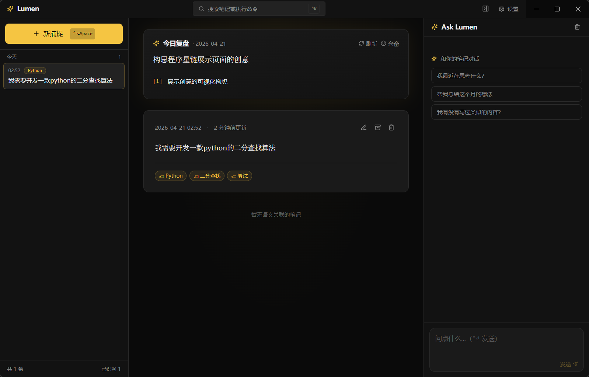
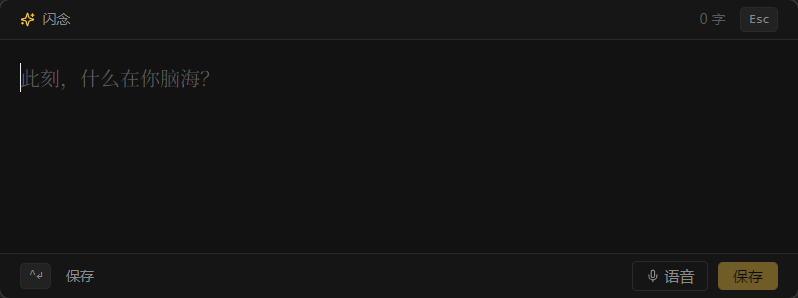
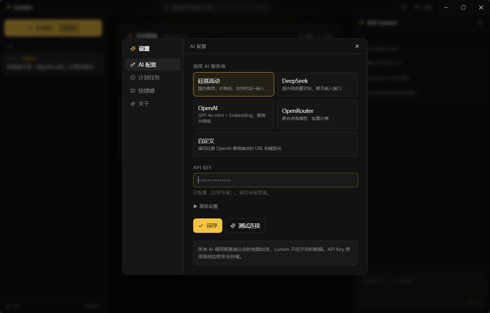

<div align="center">

# ✦ Lumen · 灵犀

**想法一闪而过，Lumen 帮你记住。**

本地优先、AI 原生的桌面「第二大脑」。不做整理，只做捕捉与重新遇见。

[](https://github.com/LeoTriumph-ux/lumen)
[](https://github.com/LeoTriumph-ux/lumen)
[](LICENSE)
[](tests/)
[](https://www.electronjs.org/)
[](https://react.dev/)

</div>

---

## 截图

> 主界面：时间线 · 笔记详情 · Ask Lumen 三栏布局



> 闪念捕捉：`Ctrl+Alt+Space` 随时唤出



> AI 设置：一键选择服务商



<!-- 📸 请将截图放入 docs/screenshots/ 目录，替换上面的路径 -->

---

## 哲学

传统笔记软件强迫你「整理」——建分类、起标题、打标签。这让 90% 的灵感死在录入的摩擦里。

Lumen 做相反的事：

- **写入端零摩擦** — 全局快捷键 → 输入框 → 回车，3 秒记完一个想法
- **整理交给 AI** — 后台默默生成语义嵌入、打标签、挖掘关联
- **输出端重氛围** — 时间线 × AI 对话 × 每日复盘，让你重新遇见过去的自己

## 核心功能

| | 功能 | 体验 |
|---|---|---|
| ⚡ | **闪念捕捉** | `Ctrl+Alt+Space` 任何地方唤出，失焦自动关闭 |
| 🧠 | **AI 织网** | 保存后自动生成 embedding + AI 打标签 + 发现语义关联 |
| 💬 | **Ask Lumen** | 和你的笔记对话（RAG），引用真实笔记可点击跳转 |
| 📅 | **每日复盘** | 每晚定时生成一句话总结 + 亮点 + 情绪 |
| 🎤 | **语音输入** | Whisper 兼容 API，说完自动转文字 |
| 🔍 | **全文搜索** | `Ctrl+K` 命令面板，中英文即搜即达 |

## 技术栈

| 层 | 技术 |
|---|---|
| **外壳** | Electron 33 |
| **前端** | React 19 · TypeScript · Vite 6 · Tailwind CSS · Framer Motion |
| **存储** | SQLite（better-sqlite3）· FTS5 全文检索 |
| **向量** | JSON Float32 数组 · 内存余弦相似度（<10k 笔记，简单可靠） |
| **AI** | 任何 OpenAI 兼容 API（内置硅基流动 / DeepSeek / OpenAI / OpenRouter 预设） |
| **测试** | Playwright · 121 个 E2E 自动化测试 |

## 前置要求

- **Node.js** ≥ 18
- **npm** ≥ 9
- **Windows**（当前仅支持 Windows，macOS/Linux 后续计划）
- **Visual Studio Build Tools**（编译 `better-sqlite3` 原生模块所需）

> 💡 如果没有 VS Build Tools，运行 `npm install` 时会提示安装。也可手动运行：
> ```
> npm install -g windows-build-tools
> ```

## 快速开始

```bash
# 克隆仓库
git clone https://github.com/LeoTriumph-ux/lumen.git
cd lumen

# 安装依赖
npm install

# 开发模式（同时启动 Vite + Electron）
npm run dev

# 生产构建
npm run build

# 打包安装程序（生成 release/ 下的 NSIS 安装包）
npm run dist
```

### 首次使用

1. 点击右上角 **设置** 或顶部横幅的 **立即配置**
2. 选择 AI 服务商（推荐**硅基流动**：国内直连、价格低、支持对话+嵌入+语音）
3. 粘贴 API Key → **保存** → **测试连接** → 看到 ✓ 即可
4. 按 `Ctrl+Alt+Space` 记下第一个想法！

## 快捷键

| 快捷键 | 作用 |
|---|---|
| `Ctrl+Alt+Space` | 全局唤出闪念捕捉 |
| `Ctrl+Enter` | 保存当前编辑 |
| `Esc` | 关闭弹窗 / 捕捉窗口 |
| `Ctrl+K` | 命令面板（搜索笔记、运行命令） |
| `Ctrl+/` | 切换 Ask Lumen 侧栏 |
| `Ctrl+,` | 打开设置 |

## 项目结构

```
electron/
  main.cjs          主进程 · 窗口管理 · IPC · 全局快捷键 · 托盘
  preload.cjs       contextBridge 暴露 window.lumen API
  db.cjs            SQLite 迁移与 CRUD
  ai.cjs            LLM 调用 · embedding · RAG 管线
  weaver.cjs        AI 织网后台工作器
  scheduler.cjs     每日复盘定时任务

src/
  App.tsx            hash 路由分发（#/main · #/capture）
  windows/
    MainWindow.tsx   三栏主界面
    CaptureWindow.tsx 闪念捕捉窗口
  components/        Timeline · NoteView · DailyDigest · AskLumen ·
                     CommandBar · SettingsModal · EmptyState
  hooks/             useNotes · useAsk · useShortcuts · useSettings
  lib/               api.ts · time.ts · markdown.ts · cn.ts
  types.ts           全局类型定义

tests/
  app.spec.ts        基础 + 功能测试（70 个）
  advanced.spec.ts   进阶测试（51 个）
```

## 测试

项目包含 **121 个端到端自动化测试**，覆盖全部核心功能：

```bash
# 先构建再跑测试
npm run build
npm run test:e2e

# 查看 HTML 测试报告
npx playwright show-report
```

测试覆盖范围：

| 类别 | 数量 |
|------|------|
| 应用启动 & 窗口管理 | 10 |
| 笔记 CRUD & 归档 | 9 |
| 搜索（中/英/边界） | 13 |
| 对话历史 | 5 |
| 设置 & AI 配置 | 10 |
| 每日复盘 | 2 |
| 闪念捕捉窗口 | 12 |
| UI 交互（命令面板/设置弹窗/时间线） | 15 |
| 键盘快捷键 | 6 |
| XSS 安全防护 | 3 |
| 并发安全 & 性能 | 7 |
| 数据持久性 | 2 |
| 窗口 resize | 3 |
| 笔记元数据 & 类型 | 5 |
| 端到端流程 | 5 |
| 事件订阅 & 生命周期 | 6 |
| **合计** | **121** |

## 数据与安全

- **本地优先** — 所有数据存在本地 SQLite 单文件：`%APPDATA%/lumen/lumen.db`
- **零上传** — AI 请求直接从你的机器发出，Lumen 作者不经手你的数据
- **加密存储** — API Key 通过 Electron `safeStorage`（Windows DPAPI）加密
- **CSP 策略** — 渲染进程只能加载本地资源 + HTTPS
- **一键备份** — 复制 `lumen.db` 文件即可

## 路线图

当前版本为 **MVP (v0.1)**。

**已完成：**

- [x] 闪念捕捉 + 全局快捷键
- [x] AI 织网（embedding + 标签 + 关联）
- [x] Ask Lumen（流式 RAG 对话）
- [x] 每日复盘（定时任务，支持手动刷新）
- [x] 命令面板 + 全文搜索
- [x] 语音输入（Whisper 兼容 API）
- [x] 暗色设计系统
- [x] 121 个 E2E 自动化测试

**后续计划：**

- [ ] 导出到 Obsidian / Logseq（批量 markdown + frontmatter）
- [ ] 端到端加密云同步
- [ ] 移动端捕捉 App
- [ ] Whisper 本地转写（`whisper.cpp` 离线模型）
- [ ] macOS / Linux 支持
- [ ] 插件系统

## 贡献

欢迎提交 Issue 和 Pull Request！

```bash
# Fork → Clone → 创建分支
git checkout -b feat/your-feature

# 开发 & 测试
npm run dev
npm run build
npm run test:e2e

# 提交
git commit -m "feat: your feature description"
git push origin feat/your-feature
```

## 致谢

本项目由 [LeoTriumph-ux](https://github.com/LeoTriumph-ux) 构思设计，AI 辅助编写。感谢 Windsurf Cascade 在架构设计、代码实现和调试过程中的全程协助。

## 许可

[MIT](LICENSE) © 2026 LeoTriumph-ux
